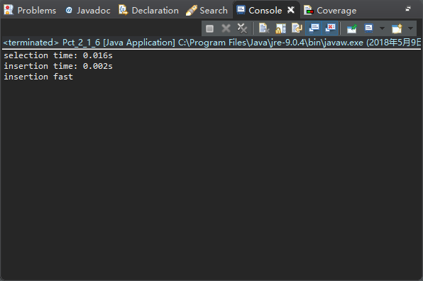

#### Pct_2_1_3 构造一个含有个N个元素的数组，是选择排序（算法2.1）运行过程中a[j]<a[min]成功的次数最多。
 

 

package chapter_2;

import edu.princeton.cs.algs4.Selection; 
import edu.princeton.cs.algs4.StdIn; 
import edu.princeton.cs.algs4.StdOut;

public class Pct_2_1_3 {

	public static void main(String[] args) {
		// TODO Auto-generated method stub

		int N;
		StdOut.print("the number of array: ");
		N = StdIn.readInt();
		Integer[] a = new Integer[N];
		StdOut.print("input array: ");
		for (int i = 0; i < N; i++) {
			a[i] = StdIn.readInt();
		}
		Selection.sort(a);

		StdOut.print("after sort: ");
		for (int i = 0; i < N; i++) {
			StdOut.printf("%d ", a[i]);
		}

	}
}

输入数组为一组逆序数列，例如：9 8 7 6 5 4 3 2 1 0时，a[j]<a[min]成功的次数最多。
 
