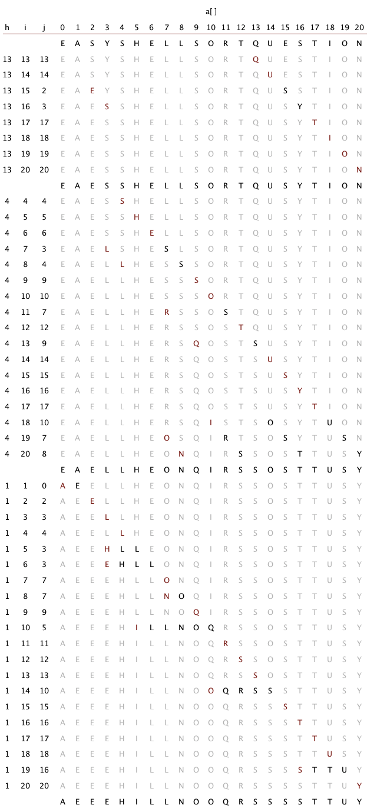

#### pct_2_1_7对于逆序数列，选择排序和插入排序谁更快?
 
 
答：经实验，插入排序较快。但是csdn上有个帖子说选择排序较快。
 
 
import edu.princeton.cs.algs4.Insertion; 
import edu.princeton.cs.algs4.Selection; 
import edu.princeton.cs.algs4.StdOut; 
import edu.princeton.cs.algs4.Stopwatch;

public class Pct_2_1_7 {

	public static void main(String[] args) {
		// TODO Auto-generated method stub
		int N=2000,T=100;
		double t1=0,t2=0;
		Integer[] a=new Integer[N];
		for (int t = 0; t < T; t++) {
			for (int i = 0; i < N; i++) {
			a[i]=1*(N-i);
			}
			t1+=time1(a);
			t2+=time2(a);
		}

		StdOut.println("selection time: "+t1+"s");

		StdOut.println("Insertion time: "+t2+"s");

		if(t1>t2)
			StdOut.println("insertion fast");
		else
			StdOut.println("selection fast");

	}
	public static double time1(Integer[] a) {

		Stopwatch timer1=new Stopwatch();
		Selection.sort(a);
		return timer1.elapsedTime();

		}

	public static double time2(Integer[] a) {

		Stopwatch timer2=new Stopwatch();
		Insertion.sort(a);
		return timer2.elapsedTime();

	}
}
 

 
